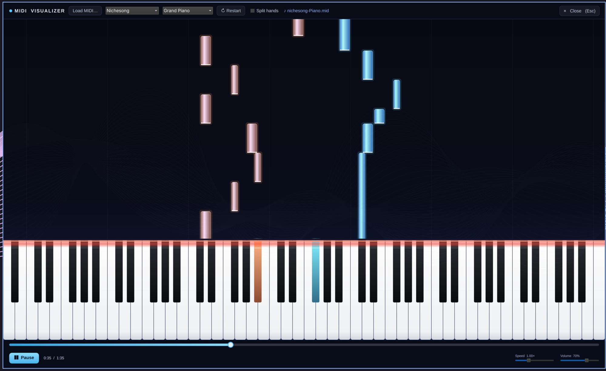

# MIDI Visualizer

Watch a `.mid` file play as glowing note bars falling onto an 88-key keyboard —
Synthesia style — and hear it through a real sampled grand piano or one of six
built-in synth instruments. For music developers and music lovers on
[Omarchy](https://omarchy.org): use it as a **shell overlay** you toggle with a
keybinding, or as a **standalone window app**. Same visualizer, your choice.



## Two ways to run

| | what it is | how you open it |
|---|---|---|
| **Overlay** | fullscreen Wayland layer surface, toggled on top of everything | `SUPER + ALT + M`, the *MIDI Visualizer (Overlay)* menu entry, or `omarchy-shell shell toggle ozdadirri.midiviz '{}'` |
| **App** | a normal window: move / resize / tile / float / alt-tab, closed with your compositor's usual keybind | the *MIDI Visualizer* menu entry, `midiviz [file.mid]`, or `quickshell -p standalone.qml` |

`install.sh` sets up whichever you want (`both` by default).

## Requirements

`python3`, `pw-play` (PipeWire), `ffmpeg` and `quickshell` ship with a standard
Omarchy install. The one extra is **`python-numpy`**, which powers the real-time
mixer:

```bash
omarchy pkg add python-numpy
```

`install.sh` checks for it (and everything else) and prints the exact command if
anything is missing — it never installs packages for you.

## Install

```bash
omarchy plugin add https://github.com/ozdadirri/omarchy-midi-visualizer.git --enable
~/.config/omarchy/plugins/ozdadirri.midiviz/install.sh both
```

`install.sh [overlay|app|both]`:

- **overlay** — adds a `SUPER + ALT + M` binding (`bindings.lua` is backed up, and
  it refuses to clobber a shortcut already in use), enables the shell plugin, and
  drops a *MIDI Visualizer (Overlay)* app-menu entry.
- **app** — drops a *MIDI Visualizer* app-menu entry and a `~/.local/bin/midiviz`
  launcher (`midiviz song.mid` opens a file).
- **both** (default) — all of the above.

`uninstall.sh` reverses it; then `omarchy plugin remove ozdadirri.midiviz`.

## Use

- **Load MIDI…** (or `Ctrl+O`) — browse the filesystem for any `.mid` / `.midi`
  file: folder navigation, quick-links to Home/Downloads/Music/…, or type an
  absolute path
- **Instrument** dropdown — Grand Piano (sampled) · Electric Piano · Music Box ·
  Pipe Organ · Synth Pad · Pluck · Sine
- Song dropdown — the two bundled sample tracks
- **↻ Restart** — jump back to the start
- **Split hands** — colour notes by hand (split at middle C)
- Transport bar — a full-width draggable progress bar, plus speed and volume
- `Space` play / pause · `Esc` (or **✕ Close**) dismiss

## Architecture

```
VisualizerStage.qml ──stdio (NDJSON)──► bin/midiviz-bridge   (python3 + numpy)
  FallingNotes.qml  (Canvas)                 ├─ minimal Standard MIDI File parser
  Keyboard.qml      (Canvas)                 ├─ sampled piano + additive synth
  Transport.qml                              │     mixer  →  pw-play
  FilePicker.qml                             └─ owns the timeline, reports the playhead

Overlay.qml     → VisualizerStage in a wlr-layer-shell PanelWindow   (the plugin)
standalone.qml  → VisualizerStage in a FloatingWindow                (the app)
```

The bridge is the single clock: audio and the falling notes are driven off one
timeline, so they never drift. It starts only when a song is loaded and is shut
down (with its `pw-play`) when the overlay is closed or the window quits. See the
header of `bin/midiviz-bridge` for the full stdio protocol.

## Not yet ported from the web app

Video export, custom background image upload, per-track colour pickers, custom
sample packs.

## Develop

```bash
omarchy plugin validate .
python3 -m unittest discover -s tests -v
quickshell -p standalone.qml            # run the app build directly
```

## Licensing

Plugin code: MIT (see `LICENSE`). The piano samples in `assets/samples/piano/`
are from the Salamander Grand Piano V3 by Alexander Holm, CC-BY 3.0 — see
`THIRD_PARTY_NOTICES.md`.
